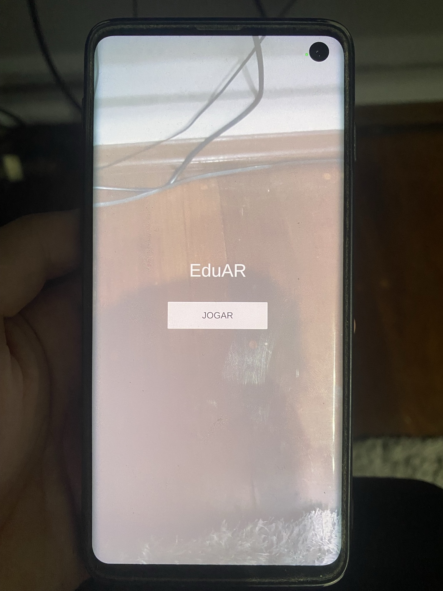
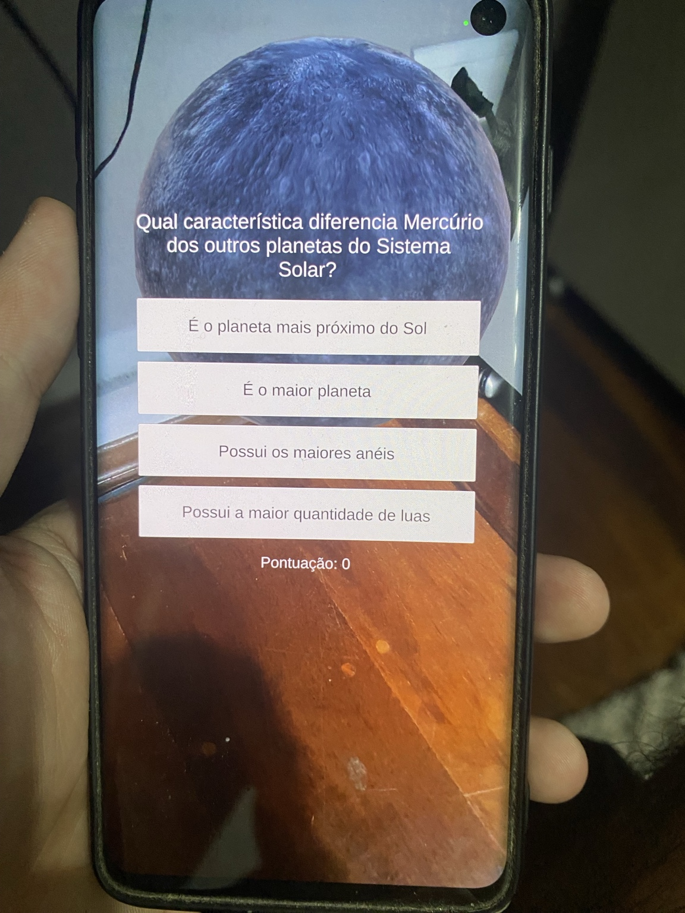
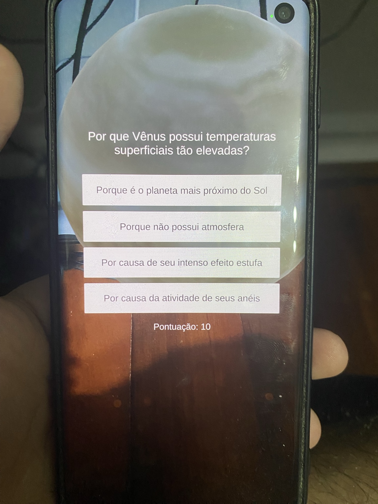
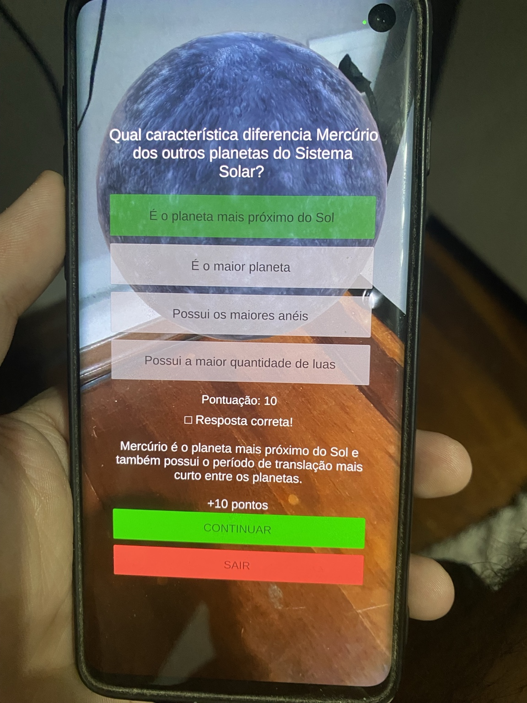
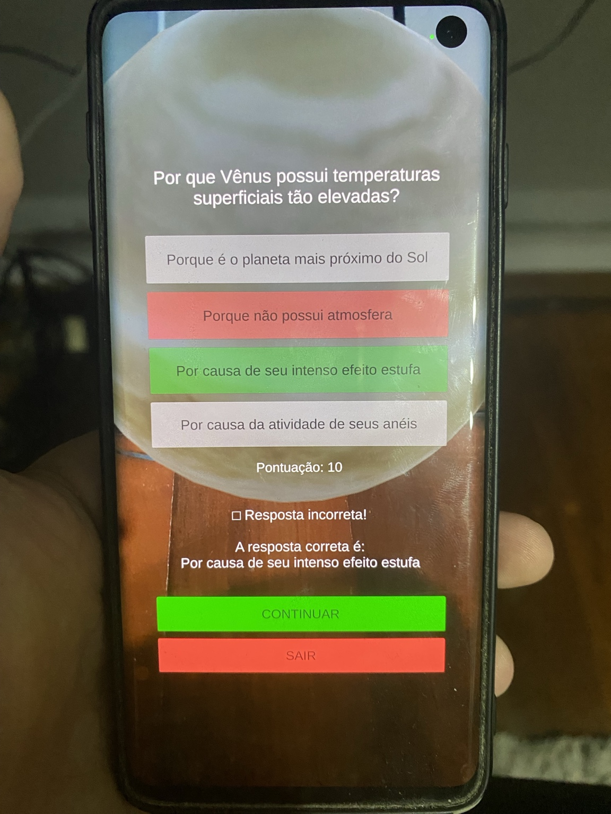

# EduAR

## Descrição do projeto

O **EduAR** é um jogo educacional para dispositivos móveis desenvolvido em **Unity**, utilizando **Realidade Aumentada (AR)** e **QR Codes** para apresentar conteúdos sobre o Sistema Solar de forma interativa.

A aplicação permite que o usuário escaneie diferentes QR Codes. Cada código representa um corpo celeste e libera um desafio específico. Após a leitura do código, o aplicativo detecta uma superfície do ambiente e posiciona nela um modelo 3D correspondente.

Depois do posicionamento do objeto, o usuário responde a uma pergunta de múltipla escolha relacionada ao corpo celeste apresentado. Ao acertar a resposta, são adicionados **10 pontos** à pontuação do jogador.

O objetivo do projeto é combinar **Realidade Aumentada, modelos 3D, leitura de QR Codes e gamificação** em uma aplicação educacional simples e interativa.

---

## Funcionalidades

As principais funcionalidades implementadas são:

- Leitura de QR Codes utilizando a câmera do dispositivo.
- Identificação de diferentes desafios por meio do conteúdo presente no QR Code.
- Detecção de superfícies utilizando Realidade Aumentada.
- Posicionamento automático de modelos 3D sobre superfícies detectadas.
- Exibição de diferentes corpos celestes em Realidade Aumentada.
- Sistema de perguntas de múltipla escolha.
- Feedback visual para respostas corretas e incorretas.
- Exibição da resposta correta quando o jogador erra.
- Sistema de pontuação.
- Adição de 10 pontos por desafio concluído corretamente.
- Controle de desafios já concluídos para evitar pontuação duplicada.
- Tela inicial com opção para iniciar o jogo.
- Opção para continuar para um novo desafio após responder uma pergunta.
- Opção para sair do desafio e retornar à tela inicial.
- Reinicialização da pontuação ao iniciar uma nova partida.

---

## Corpos celestes disponíveis

| Corpo celeste | Identificador do QR Code |
|---|---|
| Sol | `SOL_01` |
| Mercúrio | `MERCURIO_01` |
| Vênus | `VENUS_01` |
| Terra | `TERRA_01` |
| Marte | `MARTE_01` |
| Júpiter | `JUPITER_01` |
| Saturno | `SATURNO_01` |
| Netuno | `NETUNO_01` |
| Lua | `LUA_01` |

Cada desafio possui um modelo 3D e uma pergunta específica.

A pontuação máxima atual é de **90 pontos**.

---

## Fluxo da aplicação

O fluxo principal do EduAR funciona da seguinte maneira:

1. O usuário inicia o aplicativo.
2. A tela inicial é apresentada.
3. O usuário seleciona a opção para iniciar o jogo.
4. O scanner de QR Code é ativado.
5. A câmera captura os frames do ambiente.
6. O sistema procura um QR Code válido.
7. O conteúdo do QR Code identifica qual desafio deve ser iniciado.
8. O aplicativo ativa a detecção de planos em Realidade Aumentada.
9. Quando uma superfície é encontrada, o modelo 3D correspondente é posicionado nela.
10. O quiz relacionado ao corpo celeste é apresentado.
11. O usuário seleciona uma das alternativas.
12. O sistema verifica a resposta.
13. Caso a resposta esteja correta, 10 pontos são adicionados à pontuação.
14. O desafio é marcado como concluído.
15. O usuário pode continuar para outro QR Code ou retornar à tela inicial.

Fluxo simplificado:

```text
Tela Inicial
     ↓
Scanner QR Code
     ↓
Identificação do desafio
     ↓
Detecção de superfície AR
     ↓
Posicionamento do modelo 3D
     ↓
Pergunta
     ↓
Resposta
     ↓
Pontuação
     ↓
Próximo desafio
```

---

## Tecnologias utilizadas

### Unity

Engine utilizada para o desenvolvimento da aplicação, criação da interface, gerenciamento dos modelos 3D e implementação da Realidade Aumentada.

Versão utilizada:

```text
Unity 6
6000.4.9f1
```

### C#

Linguagem utilizada para implementar a lógica da aplicação.

### AR Foundation

Framework da Unity utilizado para implementar as funcionalidades de Realidade Aumentada.

Versão utilizada:

```text
AR Foundation 6.4.3
```

### ARCore XR Plugin

Plugin utilizado para permitir o funcionamento da aplicação AR em dispositivos Android compatíveis com Google ARCore.

### ZXing.Net

Biblioteca utilizada para interpretação dos QR Codes.

Versão utilizada:

```text
ZXing.Net 0.16.11
```

### NuGetForUnity

Utilizado para instalação e gerenciamento da biblioteca ZXing dentro do projeto Unity.

### glTFast

Utilizado para trabalhar com os modelos 3D no formato glTF/GLB.

### TextMeshPro

Utilizado na interface gráfica para exibição das perguntas, alternativas, pontuação e mensagens de feedback.

---

## Principais scripts

Entre os principais scripts desenvolvidos estão:

```text
QrCodeScanner.cs
QRChallengeManager.cs
ARObjectPlacement.cs
QuizManager.cs
ScoreManager.cs
HomeScreenManager.cs
```

### QrCodeScanner

Responsável por acessar os frames da câmera e realizar a leitura dos QR Codes.

A imagem da câmera é adquirida por meio do `ARCameraManager`, convertida para `RGB24` e enviada para a biblioteca ZXing.

Para reduzir processamento desnecessário, as tentativas de leitura são realizadas em intervalos definidos.

### QRChallengeManager

Responsável por interpretar o identificador lido no QR Code e iniciar o desafio correspondente.

Também mantém o controle dos desafios já concluídos durante a sessão.

### ARObjectPlacement

Responsável pela detecção dos planos e pelo posicionamento dos modelos 3D no ambiente real.

Após encontrar um plano válido, o sistema utiliza o centro da superfície detectada e converte essa posição para coordenadas globais da cena antes de posicionar o modelo.

### QuizManager

Responsável por apresentar a pergunta, preencher as alternativas, verificar a resposta selecionada, exibir o feedback e atualizar a pontuação.

### ScoreManager

Responsável por armazenar e atualizar a pontuação do jogador.

### HomeScreenManager

Responsável pelo controle da tela inicial e pelo início de uma nova partida.

---

## Modelos 3D

Os modelos utilizados na aplicação representam diferentes corpos celestes do Sistema Solar.

Os modelos foram utilizados principalmente no formato:

```text
.glb
```

Estrutura principal:

```text
Sun
Mercury
Venus
Earth
Mars
Jupiter
Saturn
    └── Rings
Neptune
Moon
```

No caso de Saturno, o planeta e seus anéis utilizam meshes e materiais diferentes, mas fazem parte do mesmo objeto principal.

---

## Dependências

Principais dependências utilizadas:

```text
Unity 6000.4.9f1
AR Foundation 6.4.3
ARCore XR Plugin 6.4.x
ZXing.Net 0.16.11
NuGetForUnity
glTFast
TextMeshPro
Input System
```

---

## Configuração do projeto

Para executar o projeto é necessário ter o **Unity Hub** instalado.

Durante a instalação do Unity, devem ser adicionados os módulos:

```text
Android Build Support
Android SDK & NDK Tools
OpenJDK
```

Depois, abra o projeto através do Unity Hub.

---

## Configuração da Realidade Aumentada

No Unity:

```text
Edit
→ Project Settings
→ XR Plug-in Management
```

Na plataforma Android, habilite:

```text
ARCore
```

O dispositivo utilizado também deve ser compatível com ARCore.

---

## Configuração Android

A aplicação foi desenvolvida e testada para Android.

Configurações utilizadas:

```text
Minimum API Level: Android 10 / API 29
Graphics API: OpenGLES3
```

Também é necessário permitir acesso à câmera no dispositivo.

---

## Build para Android

No Unity:

```text
File
→ Build Profiles
→ Android
```

Verifique se:

- Android está selecionado como plataforma.
- ARCore está habilitado.
- Android Build Support está instalado.
- SDK está configurado.
- NDK está configurado.
- OpenJDK está configurado.

Depois selecione:

```text
Build
```

O Unity irá gerar a aplicação Android para instalação em um dispositivo compatível.

---

## Dispositivos utilizados nos testes

A aplicação foi testada em dispositivos Android compatíveis com ARCore, incluindo:

```text
Samsung Galaxy S10
Samsung Galaxy S9
```

---

## QR Codes

Cada desafio é iniciado por um QR Code contendo um identificador específico.

Os QR Codes utilizados no projeto estão disponíveis na pasta:

```text
QR-Codes/
```

Identificadores:

```text
SOL_01
MERCURIO_01
VENUS_01
TERRA_01
MARTE_01
JUPITER_01
SATURNO_01
NETUNO_01
LUA_01
```

---

## Demonstração

A aplicação foi testada em um dispositivo Android compatível com ARCore.

### Tela inicial

Ao iniciar a aplicação, o usuário é apresentado à tela inicial e pode iniciar uma nova partida através do botão **JOGAR**.



### Modelo 3D e quiz em Realidade Aumentada

Após a leitura de um QR Code válido e a detecção de uma superfície, o modelo 3D correspondente é posicionado no ambiente e a pergunta relacionada ao corpo celeste é apresentada.

#### Mercúrio



#### Vênus



### Resposta correta

Quando o usuário seleciona a alternativa correta:

- a resposta é destacada em verde;
- é apresentado um texto explicativo;
- 10 pontos são adicionados à pontuação;
- o desafio é marcado como concluído.



### Resposta incorreta

Quando uma alternativa incorreta é selecionada:

- a alternativa escolhida é destacada em vermelho;
- a alternativa correta é destacada em verde;
- o sistema informa qual era a resposta correta.



---

## Estrutura principal do projeto

```text
EduAR
│
├── Assets
│   ├── Models
│   ├── Scenes
│   ├── Scripts
│   └── ...
│
├── Packages
├── ProjectSettings
├── QR-Codes
├── Docs
├── README.md
└── .gitignore
```